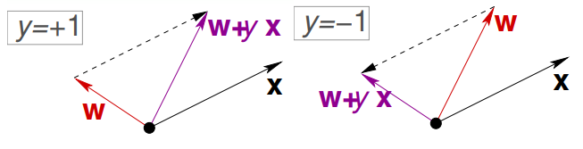

# Learning Problem (L1)
## Components to Learning
- Input: _x_ (could be a vector of some attributes)
- Output: _y_ (could be a binary value or some other vector)
- Target Function: $f : X -> Y$
- Data (we need this else no ML is happening): $(x_1, y_1), (x_2,y_2)..(x_n,y_n)$
- Hypothesis: $g : X -> Y$ 

The hypothesis function $g$ (by this course's convention), is used to approximate the unknown target function $f$. 

The general steps to get to a proper hypothesis function is then:
We want to get to some target function $f$ -> We have some training examples, We have a hypothesis set $H$ (set of potential hypothesis to try) -> We use some learning algorithm $A$ -> We get our final hypothesis where $g \approx f$

Note: we use a hypothesis set instead of picking from every formula because:
1. there is no downside as we generally know which types of formula we are going to be using in advance
2. there is an upside .....

## What is the _Learning Model_? 
Its two things:
1. The hypothesis set $H = {h_1, h_2, ..., h_n}$
2. The Learning Algorithm $A$

## A simple hypothesis set - "the perceptron"
For input $x = (x_1, x_2, ..., x_d)$ (d-dimensional vector)
Where:
$$
\text{Approve if } \sum_{i=1}^{d}w_ix_i > \text{threshold} \\
\text{Deny if } \sum_{i=1}^{d}w_ix_i < \text{threshold}\\  
$$

This linear forumla $h \in H$ can be written as:
$h(x) = \text{sign}((\sum_{i=1}^{d}w_ix_i) - \text{threshold})$ 
_where_ the function $sign$ returns a $1$ when there is a positive input, 0 if the input is also 0 and $-1$ otherwise. 

Note: in the above, we can only vary $h$, $w_i$ and the threshold. 

## Simplifications & Linearly Separable 
Simplify 
$$
h(x) = \text{sign}((\sum_{i=1}^{d}w_ix_i) - \text{threshold})\\ \\ 
\text{to} \\  \\ 
h(x) = \text{sign}((\sum_{i=0}^{d}w_ix_i)) \\ 
\text{where } w_0 = - \text{threshold and } x_0 = 1
$$

Now, the above can be further simplified to a vector form where:
$h(x) = \text{sign}(w^{T}x)$ (recall that we need to transpose one of them to get a proper inner product)

Note: _linearly separable_ refers to the data points in binary classification problems which can be separated using linear decision boundary. If the data points can be separated using a line, linear function, or flat hyperplane are considered linearly separable. 

## Perceptron Learning Algorithm 
A _misclassified_ point is one where sign$(w^Tx_n) \neq y_n$
So, we update the weight vector with the rule $w \leftarrow w + y_nx_n$ 

Why?

## Simple PLA Algorithm
At iteration $t= 1,2,3..$ pick a misclassified from the data and run PLA on it! 
Note: this assumes the data *is* linearly separable - if its not, we might keep on running into misclassified points

## Basic types of learning
1. Supervised Learning (this course) - we get (input, correct output)
2. Unsurpervised Learning - we get (input, ?) and make our own classifications
3. Reinforced Learning - we get (input, some output, grade for this output) (ex. for bots to play some game)

## Dicussion Notes
- we want to be able to represent the pattern with fewer vars to avoid overfitting 
- we sometimes want to train an ML to get some $g$ even if we know our $f$, for faster, but more approximate results
- neural net is a an hypothesis set
- 'xor' is a simple example of what a perceptron cannot resolve to 
- the PLA can also get more misclassifications after a single iteration than what we started with

## New Take from Lect1
- when the target is "known" -> sometimes we still may want to train a a neural net to give us an _approx_
answer since it might stil be faster than actually running the maths for real-time solutions 
- new way: give inputs to some equation and then try to change the neural net parameters through learning to minimize the error
produced when plugging in the predicted vars into the equation and minimizing the error produced

# Is Learning Feasible? (L2)
