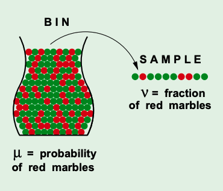
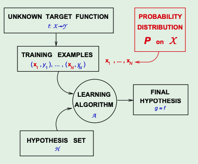
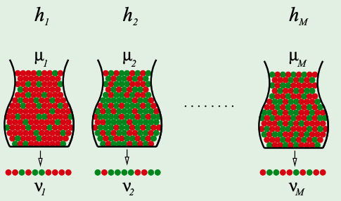
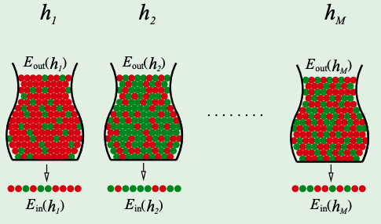

# Learning Problem (L1)
## Components to Learning
- Input: _x_ (could be a vector of some attributes)
- Output: _y_ (could be a binary value or some other vector)
- Target Function: $f : X -> Y$
- Data (we need this else no ML is happening): $(x_1, y_1), (x_2,y_2)..(x_n,y_n)$
- Hypothesis: $g : X -> Y$ 

The hypothesis function $g$ (by this course's convention), is used to approximate the unknown target function $f$. 

The general steps to get to a proper hypothesis function is then:
We want to get to some target function $f$ -> We have some training examples, We have a hypothesis set $H$ (set of potential hypothesis to try) -> We use some learning algorithm $A$ -> We get our final hypothesis where $g \approx f$

Note: we use a hypothesis set instead of picking from every formula because:
1. there is no downside as we generally know which types of formula we are going to be using in advance
2. there is an upside .....

## What is the _Learning Model_? 
Its two things:
1. The hypothesis set $H = {h_1, h_2, ..., h_n}$
2. The Learning Algorithm $A$

## A simple hypothesis set - "the perceptron"
For input $x = (x_1, x_2, ..., x_d)$ (d-dimensional vector)
Where:
$$
\text{Approve if } \sum_{i=1}^{d}w_ix_i > \text{threshold} \\
\text{Deny if } \sum_{i=1}^{d}w_ix_i < \text{threshold}\\  
$$

This linear formula $h \in H$ can be written as:
$h(x) = \text{sign}((\sum_{i=1}^{d}w_ix_i) - \text{threshold})$ 
_where_ the function $sign$ returns a $1$ when there is a positive input, 0 if the input is also 0 and $-1$ otherwise. 

Note: in the above, we can only vary $h$, $w_i$ and the threshold. 

## Simplifications & Linearly Separable 
Simplify 
$$
h(x) = \text{sign}((\sum_{i=1}^{d}w_ix_i) - \text{threshold})\\ \\ 
\text{to} \\  \\ 
h(x) = \text{sign}((\sum_{i=0}^{d}w_ix_i)) \\ 
\text{where } w_0 = - \text{threshold and } x_0 = 1
$$

Now, the above can be further simplified to a vector form where:
$h(x) = \text{sign}(w^{T}x)$ (recall that we need to transpose one of them to get a proper inner product)

Note: _linearly separable_ refers to the data points in binary classification problems which can be separated using linear decision boundary. If the data points can be separated using a line, linear function, or flat hyperplane are considered linearly separable. 

## Perceptron Learning Algorithm 
A _misclassified_ point is one where sign$(w^Tx_n) \neq y_n$
So, we update the weight vector with the rule $w \leftarrow w + y_nx_n$ 

Why?

## Simple PLA Algorithm
At iteration $t= 1,2,3..$ pick a misclassified from the data and run PLA on it! 
Note: this assumes the data *is* linearly separable - if its not, we might keep on running into misclassified points

## Basic types of learning
1. Supervised Learning (this course) - we get (input, correct output)
2. Unsurpervised Learning - we get (input, ?) and make our own classifications
3. Reinforced Learning - we get (input, some output, grade for this output) (ex. for bots to play some game)

## Dicussion Notes
- we want to be able to represent the pattern with fewer vars to avoid overfitting 
- we sometimes want to train an ML to get some $g$ even if we know our $f$, for faster, but more approximate results
- neural net is a an hypothesis set
- 'xor' is a simple example of what a perceptron cannot resolve to 
- the PLA can also get more misclassifications after a single iteration than what we started with

## New Take from Lect1
- when the target is "known" -> sometimes we still may want to train a a neural net to give us an _approx_
answer since it might stil be faster than actually running the maths for real-time solutions 
- new way: give inputs to some equation and then try to change the neural net parameters through learning to minimize the error
produced when plugging in the predicted vars into the equation and minimizing the error produced

# Is Learning Feasible? (L2)
_Motivation:_ even if we manage to approximate some $g$ to be about what $f$ is supposed to be over some finite set of points (in the case of supervised learning) - are we actually ever able to ensure $g(x) \approx f(x)$ for some $x$ s.t $x$ was not part of the original "training set". 

## A related experiment 
Assume we have a "bin" of red and green marbles:  
$Pr( \text{picking a red marble} ) = \mu$  
$Pr( \text{picking a green marble} ) = 1 - \mu$  

- the value of $\mu$ is unknown to us and we want to find it
- we pick $N$ marbles independently 
- let the fraction of those $N$ marbles, i.e. the sample, which are red be $\nu$

## Is $\nu$ at all useful for us to infer anything about $\mu$
- no -> since the sample could be mostly green while the bin is mostly red
- but also yes, if $N$ is large then the sample frequency $\nu$ is likely to be close to bin frequency $\mu$

## Hoeffding's Inequality
- we can approximate $\nu$ to be $\mu$ if $N$ is large, but how do we ensure this probabilistically? 
- we can bound the absolute difference $\lvert \nu - \mu \rvert$ with an $\epsilon$ (i.e. bound the error)
$$
\text{Hoeffding's Inequality:} \\ 
\mathbb{P}[\lvert \nu - \mu \rvert > \epsilon] \leq 2*e^{-2\epsilon^2*N}
$$
i.e. the probability that the error in $\nu \approx \mu$ exceeds the upper bound we set, $\epsilon$, is itself upper bounded by the R.H.S above (proof avail online)

To Note:  
- the inequality is valid for all $N > 0$ and $\epsilon > 0$
- bound does not depend on $\mu$
- actually, instead of us approximating $\nu$ to $\mu$,  what we end up doing is approximating $\mu$ to $\nu$ when learning.
- the cause is $\mu$ and the effect is $\nu$, but we are using the effect to infer the cause 

## How does this relate to learning?
- *Bin*: the unknown number is $\mu$
- *Learning*: the unknown is a function $f : X \rightarrow Y$
- in the prev. experiment, each marble is a point $x \in X$
- if $h(x) = f(x)$, the hypothesis is right and wrong otherwise 
- realise that the $h(x)$ or $f(x)$ just says if some marble is red or green 

## Probability Dist. P on X
- to further model this experiment properly, it is important to attach a probability dist on X since there is a certain "chance" associated with drawing a red or green marble  
- also note, we do not actually care what this distribution is exactly, we just must be aware that there is one

## Verification vs Learning
- if we are able to have some $h$ that does get the same results as some $f$, and then say that **its** ($h$'s) $\nu$ generalizes to $\mu$ and stop -> we have not actually learnt 
- in the above scenario, we have only verified our $h$
- to learn, we must do this for multiple $h$'s

## Multiple Bins
- how we actually learn involves us generalizing the bin model to more than one hypothesis (i.e. testing multiple $h$'s with their own individual bin)
- then picking whichever one "performs the best" (i.e. in terms of the Hoeffding Inequality)

## Notation for learning
- to make the dependency of $\mu$ and $\nu$ on a particular $h$ more explicit, consider the following:
* $\nu$ is "in sample" denoted by $E_{\text{in}}(h)$
* $\mu$ is "out of sample" denoted by $E_{\text{out}}(h)$  
(out-of-sample is what people actually care about)

The Hoeffding inequality now becomes $\mathbb{P}[\lvert E_{\text{in}}(h) - E_{\text{out}}(h) \rvert > \epsilon] \leq 2*e^{-2\epsilon^2*N}$

## Hoeffding Inequality over multiple bin!
- the Hoeffding inequality doesn't actually apply to multiple bins
- however, we can solve this simply
- assume we have $M$ hypothesis, then for some chosen $g \in H$ (remember $g$ is what we use to say it is approximately $f$): 

$$
\mathbb{P}[\lvert E_{\text{in}}(g) - E_{\text{out}}(g) \rvert > \epsilon] \leq 2*M*e^{-2\epsilon^2*N}
$$

- i.e., the probability of the picked $g$ approximating $\mu$ with $\nu$ and going beyond the upper bound set is always going to be less than the sum of the union probability bound of every $h \in H$. ($g$ is just one of the $h$'s and there are $M$ $h$'s and the R.H.S of the inequality is the same for all)
- this is sorta dumb but it is correct 
- how we actually solve the issues of possibly having infinite $h$'s is tackled in later notes, because as you can imagine at the moment, as $M$ tends to infinity, the probability of our approximation going above the set upper bound gets bounded by infinity -> which is not a very useful thing to infer at all.

## Discussion Notes
- this lecture's content is meant to be general, i.e. these concepts hold for any probability dist., hypothesis set and target function
-