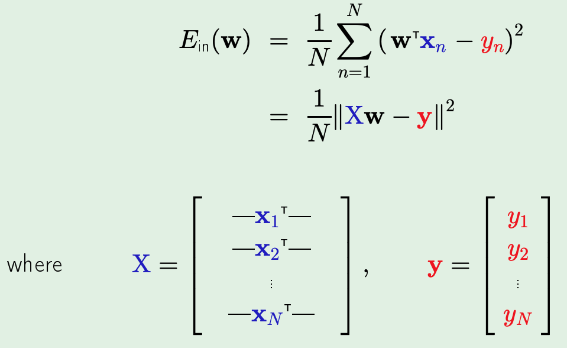
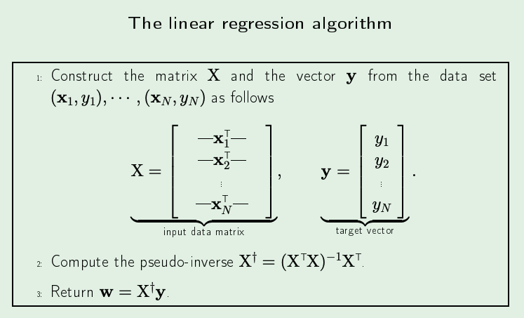
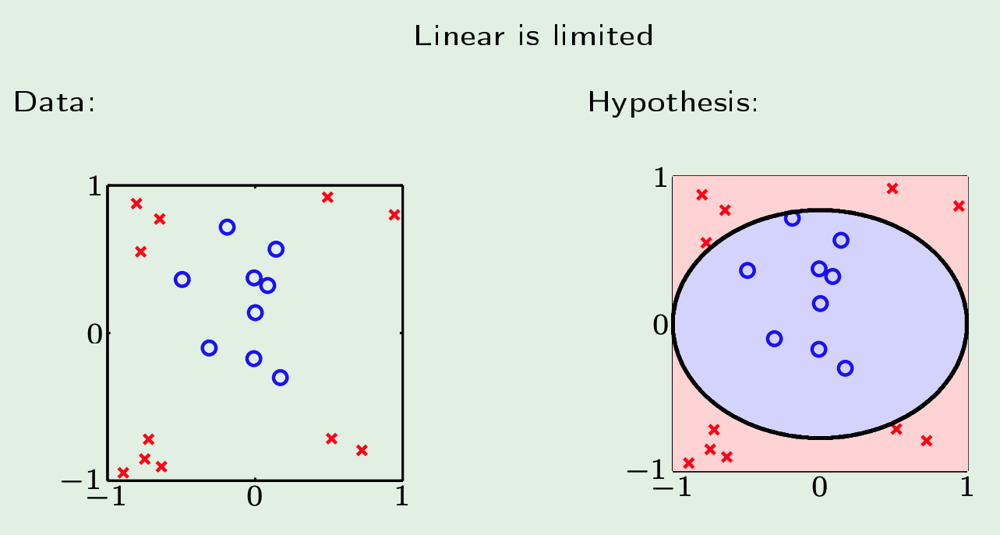
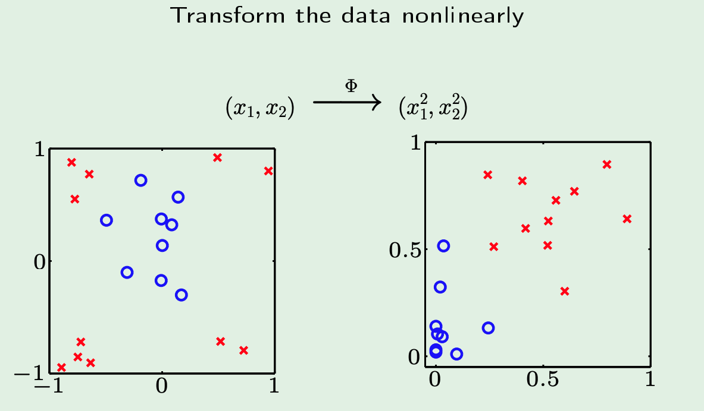

# The Linear Model (L3)

_Features_ - extracting useful information 
_Regression_ means real value output 
_Squared Error_ = $( h(x) - f(x) )^2$ 

## Linear Regression
- define $h(x) = \sum_{i=0}^{d}w_ix_i = w^Tx$
- in-sample error: $E_{\text{in}}(h) = \frac{1}{N}\sum_{n=1}^{N}(h(x_n)-y_n)^2$
- idea is to essentially minimize the squared error 

- above, we replaced $h$ with $w$ instead since that is the only thing that we are actually changing 

- yes, its literally a single step
- also, if $X$ is not invertible - there are apparently ways around it to still do the above

## Linear Regression for Classification
- linear reg learns a real-values function $y = f(x) \in \mathbb{R}$
- binary-values functions are also real-valued! $\pm 1\in \mathbb{R}$
- therefore, we can just use linear reg to get $w$ s.t $w^Tx_n \approx y_n = \pm 1$ 
- so, sign$(w^Tx_n)$ is likely to agree with $y_n = \pm 1$ 
- all of this is to say, the initial weights $w$ after doing linear reg will at least be good! (as opposed to starting from 0s with PLA and then iterating and hoping we have no misclassification )

## Linear Regression using Non-Linear Transformation 

*Note* - the important thing to notice in all of this is that instead of being linear w.r.t $x_i \in X$, we actually assume those are just some constants (since they are coming from training data). We actually are linear in $w since that is what we are actually changing. (Recall that we are using "the effect to infer the cause")

- we would like to be able to do the RHS but we know that the data is linearly inseparable in that case

- if we just apply some function $\phi$ to every point which just plots the square distance from origin of each point -> we create the RHS which is definitely linearly separable.