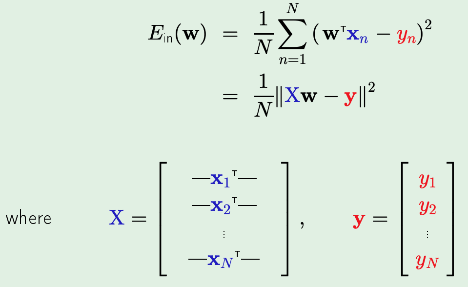
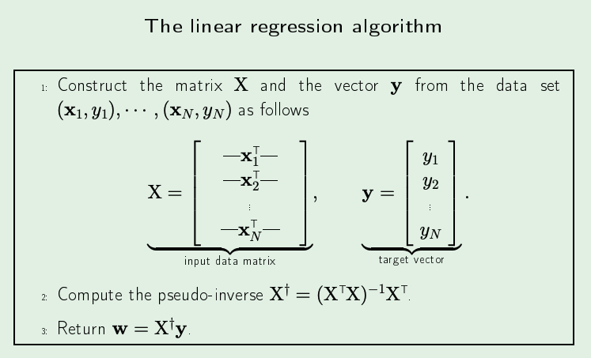
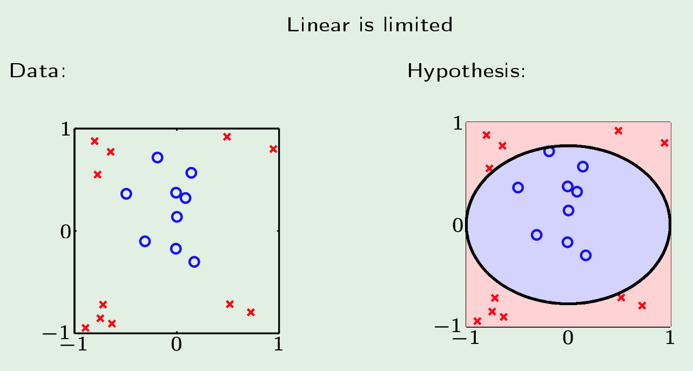
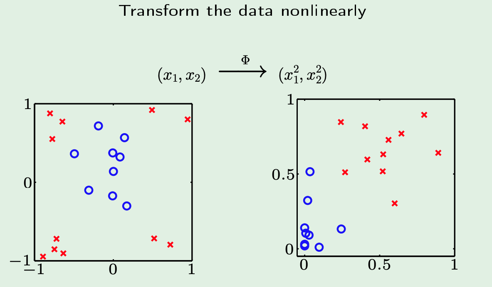
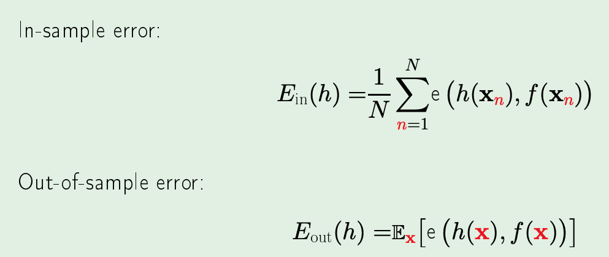
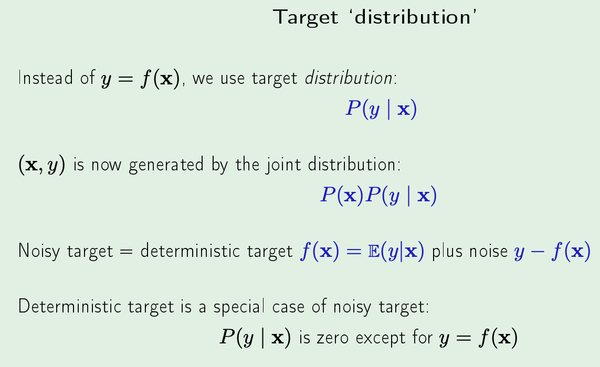
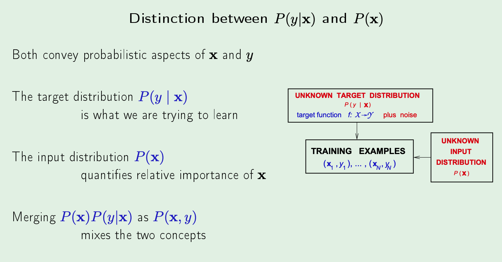
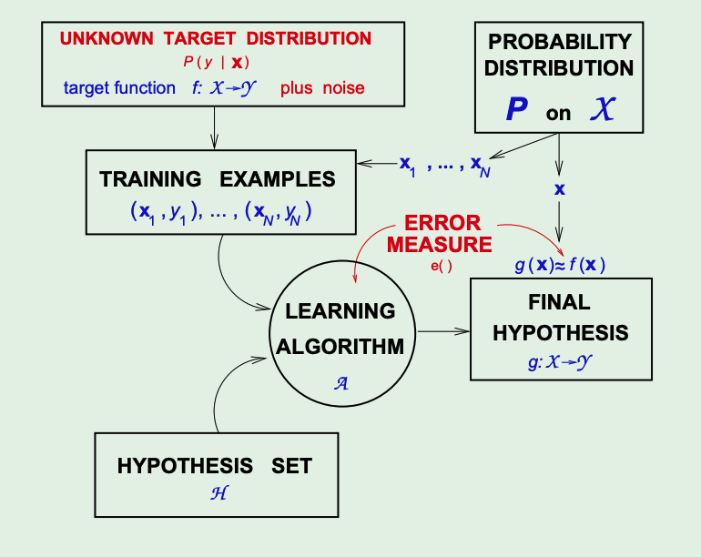

# The Linear Model (L3)

_Features_ - extracting useful information 
_Regression_ means real value output 
_Squared Error_ = $( h(x) - f(x) )^2$ 

## Linear Regression
- define $h(x) = \sum_{i=0}^{d}w_ix_i = w^Tx$
- in-sample error: $E_{\text{in}}(h) = \frac{1}{N}\sum_{n=1}^{N}(h(x_n)-y_n)^2$
- idea is to essentially minimize the squared error 

- above, we replaced $h$ with $w$ instead since that is the only thing that we are actually changing 

- yes, its literally a single step
- also, if $X$ is not invertible - there are apparently ways around it to still do the above

## Linear Regression for Classification
- linear reg learns a real-values function $y = f(x) \in \mathbb{R}$
- binary-values functions are also real-valued! $\pm 1\in \mathbb{R}$
- therefore, we can just use linear reg to get $w$ s.t $w^Tx_n \approx y_n = \pm 1$ 
- so, sign$(w^Tx_n)$ is likely to agree with $y_n = \pm 1$ 
- all of this is to say, the initial weights $w$ after doing linear reg will at least be good! (as opposed to starting from 0s with PLA and then iterating and hoping we have no misclassification )

## Linear Regression using Non-Linear Transformation 

*Note* - the important thing to notice in all of this is that instead of being linear w.r.t $x_i \in X$, we actually assume those are just some constants (since they are coming from training data). We actually are linear in $w since that is what we are actually changing. (Recall that we are using "the effect to infer the cause")

- we would like to be able to do the RHS but we know that the data is linearly inseparable in that case

- if we just apply some function $\phi$ to every point which just plots the square distance from origin of each point -> we create the RHS which is definitely linearly separable.

# Error & Noise (L4)

## Cont. Linear Regression using Non-Linear Transformation 
Just to make this process extremely clear, below are the exact steps about how this works:
1. we first take some input **x** = $(x_0, x_1 , ... , x_d) \xrightarrow{\phi}$ **z** = $(z_0, z_1, ..., z_{\tilde{d}})$ ($\phi$ is the transformation function)  
2. $\bold{x_1}, ..., \bold{x_n} \xrightarrow{\phi} \bold{z_1}, ..., \bold{z_n}$   
3. No changes in output $y_n$ either before or after transformation 
4. No weights assigned in the $X$-space, only assigned in the $Z$-space post transformation. This is denoted as $\tilde{w} = (w_0, w_1, ..., w_{\tilde{d}})$  
5. $g(x) = \text{sign}( \tilde{w}^T \cdot \phi(\bold{x}))$ (i.e. we only work with the transformed $x$ and its associated weight)  

## Error Measures
- If we look back at what "learning" means, we generally say that we have "learnt" if $h \approx f$ 
- but exactly how close do they need to be?
- this concept is captured by error measuring functions: $E(h,f)$
- these functions usually have a _pointwise definition_, i.e. for every $x \in X$, we find $e(h(x), f(x))$ 
- some examples of these pointwise error functions include the square error function ($(h(x) - f(x)^2)$) or the binary error function ($h(x) \neq f(x)$)
- then, to go from pointwise to overall we generally just take the average of all pointwise errors. Two examples below:

## How do we choose error measures?
- generally this is specified by the user
- for concretely we ask: do we care about minimizing false positives or do we more care about minimizing false negatives. (among other potential questions, but these are the easiest)

## Noisy Targets
- In reality, we never really have just a function which we are trying to capture but rather a target *distribution*: 

- i.e. the deterministic target function is just a special case of the noisy target

## Final Learning Diagram for Supervised Learning 

## Simple Intro to Learning Theory
- to say learning is feasible, we have to say that $E_{\text{out}}(g) \approx E_{\text{in}}(g)$
- however, learning itself is when we are able to say $E_{\text{in}}(g) = 0$ (i.e. in the out of sample performance, our $g$ is exactly the same as the target function) 

## Two Main Questions in Learning 
1. Can we make sure that $E_{\text{out}}(g)$ is close to $E_{\text{in}}(g)$? (theoretical techniques)
2. Can we make $E_{\text{in}}(g)$ small enough? (practical techniques)