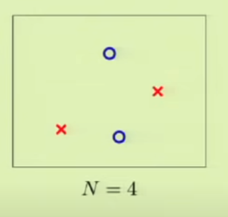
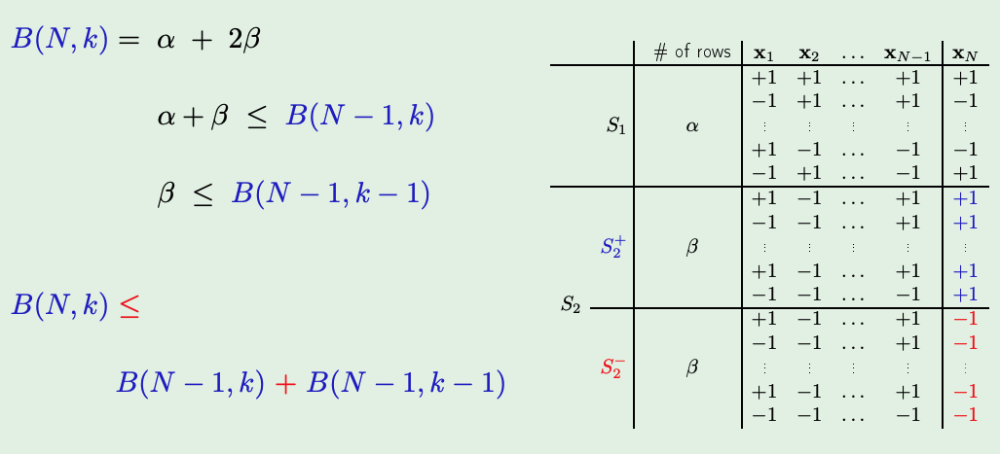
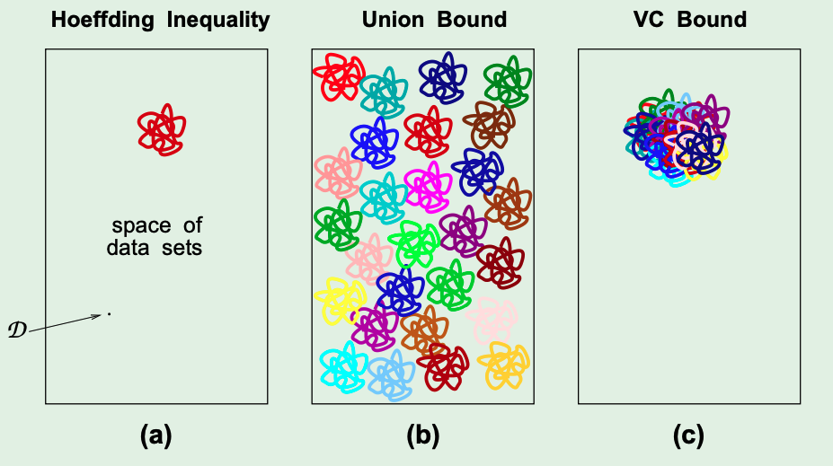

## Testing v. Training 
Testing follows the familiar Hoeffding Inequality: 
$$
\mathbb{P}[\lvert E_{\text{in}}(g) - E_{\text{out}}(g) \rvert > \epsilon] \leq 2*e^{-2\epsilon^2*N}
$$
Where in-sample refers to the tests themselves and out-of-sample being anything else. 

Training is almost the same, but with an added $M$ constant as below:
$$
\mathbb{P}[\lvert E_{\text{in}}(g) - E_{\text{out}}(g) \rvert > \epsilon] \leq 2*M*e^{-2\epsilon^2*N}
$$
This is because we are training across multiple sets of input -> but our out-of-sample performance may suffer since we end up "memorizing" across the different training sets (as part of the hypothesis set). 

The motivation behind this lecture is to replace that $M$ with something that does not vary across an hypothesis set (also since $M$ could always just go to $\infty$ which makes the entire inequality useless.)

## Where did M come from again?
Essentially, if say some bad events $B_m$ are
$$
\mathbb{P}[\lvert E_{\text{in}}(h_m) - E_{\text{out}}(h_m)] > \epsilon
$$ 
Where the Union Bound is defined as:
$$
\mathbb{P}[B_1 or B_2 or .... or B_m] =  \mathbb{P}[B_1] + \mathbb{P}[B_2] + ... + \mathbb{P}[B_m] 
$$ 

However, the above is essentially saying we have been bounding a particular hypothesis's error with the sum across EVERY hypothesis's error. This approach is clearly problematic as we are overlapping the same error lots!

## Ok, but what to replace M with?
Dichotomies! (_what??_)  
-> Idea: instead of defining hypothesis for the ENTIRE input space, we only look at some pre-selected points and more mathematically:   
a hypothesis: _h_ : _X_ $\rightarrow$ $\{-1,1\}$  
a dichotomy: _h_ : $\{x_1, x_2, ..., x_N\}$ $\rightarrow$ $\{-1,1\}$  
$\lvert H\rvert$ can be infinite, but $\lvert H(x_1,x_2,...,x_n)\rvert$ does not have to be (just don't $n \rightarrow \infty$)

Note: we will essentially be comparing the error of our hypothesis functions wrt some selected points 

## The Growth Function 
So, what is actually replacing M? -> $m$! (not kidding)  
$$
m_H(N) = max_{x_1,x_2, ... x_n \in X}\lvert H(x_1,...,x_N)\rvert
$$
The above is the growth function that counts the MOST dichotomies (rmb: similar to a hypothesis but with a limited input space) on any N points. 
We can say that this growth function satisfies:
$$
m_H(N) \leq 2^N
$$
Why? since there are only $2^N$ possible values that the entirety of $x_1...x_N$ could represent (either they are a 1 or a -1).

Note: $m_H(N)$ is essentially just finding the max number of unique functions that lead to a set of unique values for $x_1...x_N$ (in the case of PLA - how many unique straight lines can we draw that split the chosen points s.t. the set of values assigned (values from {1,-1} ) to each point is unique)

Note: we eventually want to replace $M$ with $m_H(N)$

## Why do we care?  
$$
\mathbb{P}[\lvert E_{\text{in}}(g) - E_{\text{out}}(g) \rvert > \epsilon] \leq 2*M*e^{-2\epsilon^2*N}
$$
In the inequality above, if we replace $M$ with $m_H(N)$ and prove that $m_H(N)$ is a polynomial -> the exp term will essentially make the entire RHS very small as $N$ increases. (intuitively, this is exactly what we would expect - the more data, the lesser the error rate).

Problem: how to prove $m_H(N)$ will be a polynomial? (with more definitions of course) 

## The break point of $H$
The break point of some hypothesis set $H$ is defined as:  
"If no data set of size $k$ can be _shattered_ by $H$, then $k$ is the break-point of $H$" -> $m_H(k) < 2^k$  

what?  
- _shattered_ here refers to the fact that we can (either with a 2D line or some hyperplane), split the input space s.t. we can divide all the chosen points, so every possible output is viable (i.e. by saying one side is a +1 and the other is -1)
- if we **cant** shatter the hypothesis set due to the number of points picked (e.g. in your head imagine PLA, if you pick 4 random points on a 2D plane - can you draw a line to represent every possible unique output? No coz see the pic below) - then we can guarantee that the total number of unique classifications will be < $2^k$ (closer to polynomial - and actually, it is guaranteed to be a polynomial, more on this below)

- cant draw any line to create this very classification 

## What does a break point help with?
Here are the properties:  
- if there is no break point -> $m_H(k) = 2^k$   
- if there is a break point  -> $m_H(k)$ is **polynomial** in N (proof later on)

## Theory of Generalization 
If there is a break point:
1. Proof that $m_H(N)$ is polynomial 
2. Proof that $m_H(N)$ can replace M

## Bounding $m_H(N)$
We want to show that $m_H(N) \leq$ a polynomial 
Define:  
$B(N,k)$: Maximum num. of dichotomies on $N$ points, with break point $k$ 

Note: $B(N,k)$ is not affected by the input space, the target function or the hypothesis set!
## Results

- Idea: construct this particular table for some $B(N,k)$. Call the last point $x_N$ an extension. 
- The first set of rows in $S_1$ refer to the dichotomies where the last point $x_N$ is either +1 or -1 for some set of points $x_1...x_{N-1}$. That is to say, given some $x_1...x_{N-1}$ points, the point following those must be classified ONLY as EITHER +1 OR -1 but NOT BOTH. 
- The second set $S_2$ is similar, except for any given $x_1...x_{N-1}$ points, we have that the last point can be either +1 (in which case we put this set of points in $S_2^+$) or -1 ($S_2^-$) 
- Together these two sets describe all dichotomies of some N points with a break point $k$ 
- Note that this is a construction that we are describing for the results mentioned above - we are doing this to describe some recursion for us to actually compute the value of $B(N,k)$ by breaking the problem down.
- Also note that in $S_1$, we enforce that no $x_1...x_{N-1}$ is repeated 
- $x_1...x_{N-1}$ is $S_2^+$ and $S_2^-$ are the SAME (only thing that differentiates the two by definition is their extension)  

Notes:
- How do we know if there are any $x_1 ... x_{n-1}$ with two different extensions (i.e. stuff in $S_2$) -> we don't! but if there were, they would be in $S_2$ (this is completely generalised and that is the point!)
- How do we know that $x_1...x_{n-1}$ are not repeated? -> that is exactly how they are being constructed 
- How do we know that stuff from $S_1$ is not in $S_2^+$ -> if it appears in $S_2^+$ then it must have two extensions so it cant be in $S_1$ which only has one type of extension 
- why is $\alpha + \beta \leq$ and not $=$? because it is very possible that we have not exhaustively listed everything in $\alpha$ and $\beta$ for $N-1$
- why is it $k-1$? -> since with every set of points in the set $S_2^+$ - the extension is just +1 and there is nothing else it can be. So, just for that set, we can decrement the break-point since it makes no difference. (also we need to do this coz recursion)

Theorem:  
$$
B(N,k) \leq \sum_{i=0}^{k-1}{N \choose i}
$$
(proof uses the recursion described earlier with induction)

Theorem:  
$$
\mathbb{P}[\lvert E_{\text{in}}(g) - E_{\text{out}}(g) \rvert > \epsilon] \leq 4*m_H(2 \cdot N)*e^{-\frac{1}{8}\epsilon^2*N}
$$
- this is the **The Vapnik-Chervonenkis Inequality** which actually makes learning all possible. VC dim will follow shortly (the abbreviation will now make more sense)
- proof of this is 6 pages and I am choosing to omit that entirely, but it can be found online!

## Key Characteristics of the VC Bound

- note: each little squiggle above represents the case where $\lvert E_{\text{in}}(g) - E_{\text{out}}(g) \rvert > \epsilon$ -> i.e. the "Bad Event"
- instead of summing up all the errors and thinking of each one as separate (in the case of multi-bin Hoeffding Inequality), we can finally appreciate their overlap and deal with it as such. 