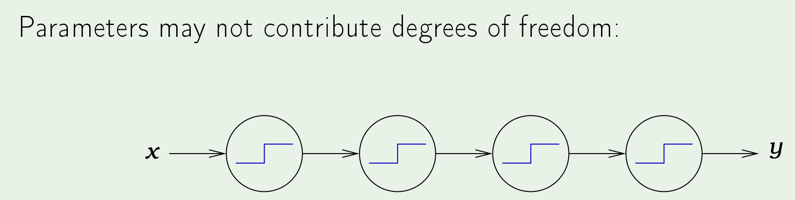

The **VC Dimension** of some hypothesis set $H$ is denoted by $d_{vc}{H}$ and is the largest value of $N$ for which $m_H(N)$ = $2^N$. That is to say, the "most number of points $H$ can shatter".
- if $d_{vc}{(H)} = V$, then for any $N \leq V$, $H$ can shatter $N$
- if $d_{vc}{(H)} = V$, then for any $k > V$, $k$ is a break point for $H$

Redefining the growth function:   
$$
m_H(N) \leq \sum_{i=0}^{k-1}{N \choose i} \text{ [growth in terms of the break point]} \\
m_H(N) \leq \sum_{i=0}^{d_{vc}}{N \choose i} \text{ [growth in terms of the VC dim.]}
$$
Note that in the above growth function def in terms of the VC dim., the maximum power is $N^{d_{vc}}$. 

## What the hell does this have to do with learning?
Important Result:  
if $d_{vc}{(H)}$ is finite $\rightarrow$ $g \in H$ will generalize (i.e. adapt well out-of-sample)  
Moreover, this statement can be made independent of:  
- the *learning algorithm* (the picking of any particular hypothesis no longer matters since we are guaranteeing that the picked $g$ will generalize)
- the *input distribution* (since we are able to pick points such that we maximize $d_{vc}$, it does not matter what the original distribution was)
- the *target function* (we only need it for generating some training examples, but the analysis does not actually care about what this function is)

## VC dimension for perceptron 
- $d_{vc}$ = $d+1$, where $d$ is the dimension of the input space

## Proof in images 
- **Firstly**, that $d_{vc} \geq d+1$:  

- we construct a matrix $X$ of some $d+1$ points. Note that for each row, we will have $d+1$ columns (recall $x_0$ = 1). 

- that is to say, we can find some weight vector which **at least** (hence why $\geq$) leads to outputting any of the $2^N$ possible classifications

- **Secondly**, we need to show that $d_{vc} \leq d+1$ or that we cannot shatter **any** set of $d+2$ points

- since we defined our matrix $X$ initially as a bunch of orthogonal unit vectors (vectors of points that is), it must be the case that (since we have more vectors than dimensions now), that this new added vector **is** linearly dependent on a combination of every other vector in the matrix. 
- now we just need to prove that the $a_i$s are not all zeroes and this is actually very easy to see - recall that since the very first column in $X$ is just all $1$s - the only way to represent that vector as a linear combination of every other vector **requires** that some of the $a_i$'s be non-zero (now we're talking!)

- if we want the very last point $x_j$ to be -1, since this is a valid dichotomy, we will note that this is actually not possible -> 

- notice that for perceptrons, we need to multiply by some weight vector. However, since we constructed this such that $y_i$ = sign($w^Tx_i$) = sign($a_i$), their product is guaranteed to be positive. Therefore, $y_j$ will be a sum of some positive values, and cannot be -1. Hence $d_{vc} \leq d+1$.

## Interpreting the VC Dimension 
1. DOF
- $d_{vc}$ contributes to the "binary" degrees of freedom (as opposed to analog degrees of freedom which is more of a range)
- $d_{vc}$ contributes to the effective number of DOF, parameters by themselves may not do this (see below) 

- 8 parameters but only 1 DOF

2. Number of data points needed to learn 

## The Generalization Bound 

