lear
# Linear Model 2    
What we have done:
- linear classification (perceptron algorithm)
- linear regression 
- non-linear transformations (except analysis on generalization)

# Nonlinear transforms
Recall that if we are able to transform a nonlinear input space with some function $\phi$ to a linear space, then finding a hypothesis $g$ in the input space is just: $g(x) = \text{sign}( \tilde{w}^T \cdot \phi(\bold{x}))$ (tilde weight is just weights in the transformed space than the input space!)

## The price of nonlinear transforms
- from the VC dim analysis, we know that for a $d$ dimensional point in the input space, we get a $d_{vc}$ = $d+1$.
- after we have a transformation $\phi$, and go from some $x$ to some $z$ ($Z$ space denoting the transformed space), the new dimensionality of the points in $Z$ will be greater since we are adding extra information to describe the nonlinearity better. That is to say, $\tilde{d} > d$, and so the VC dim of the $Z$ space is $d_{vc} \leq \tilde{d} + 1$. 
- why less than for the transformed space? well because we still only care about the VC dim of the actual nonlinear space $X$. A transformed space $Z$ may add extra points which no point in $X$ maps to, and as a result the number of points taken to shatter $Z$ could very well be higher than $X$. Hence we say less than to reflect that since we only care about $X$ here.

## Two non-separable cases
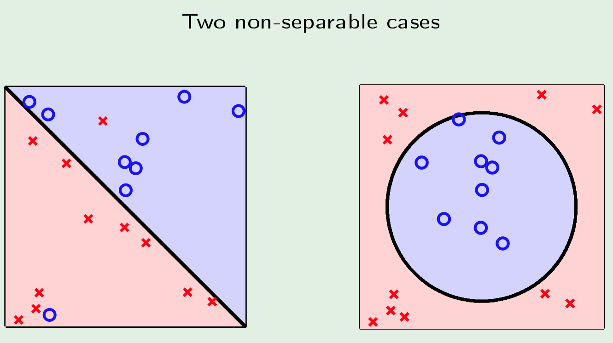
- For the left hand side, it is almost linearly separable. It will be an overkill to do transformations on it and go through all the analysis just to try to get an $E_{in} = 0$
- For the right hand side, we definitely need to consider transformation. 
- However, by looking at the data, we might be tempted to change the transformation to something along the lines of:
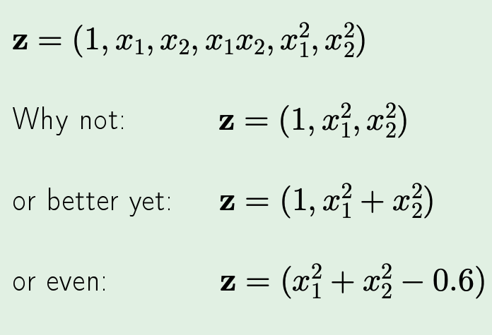
- DONT! This harms generalization since we are now completely telling the algorithm to cater to this particular data. The term for this is **data snooping** and it hurts $E_{out}$. (the analogy is, instead of you telling the machine to learn and adapt, you are instead learning and telling the machine to pick up from where you left of - how you analyze human learning is beyond this topic!)

# Logistic Regression
Define the logistic function $\theta$ as:
$$
\theta{(s)} = \frac{e^2}{1+e^s}
$$
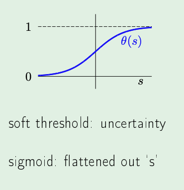

Now define our hypothesis to be $h(x) = \theta{(s)}$, where we interpret this as a probability (e.g. probability of an occurrence, in order to predict it)

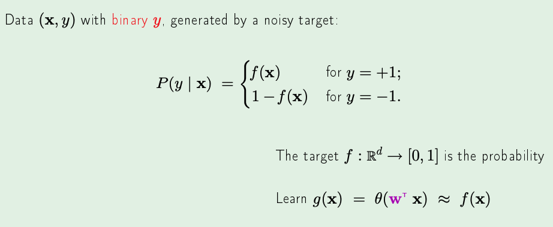
- note: the output of the target function **MUST** be binary (i.e. something has or has not occurred from the prev e.g.)

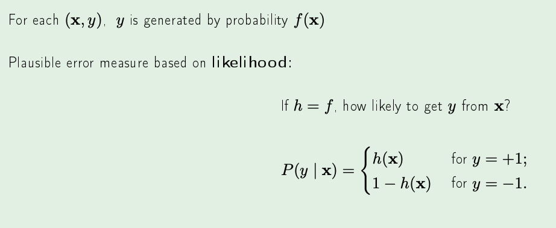
- i.e. the probability of a $y$ is our hypothesis $h(x)$, and for $\neg y$ its $1 - h(x)$

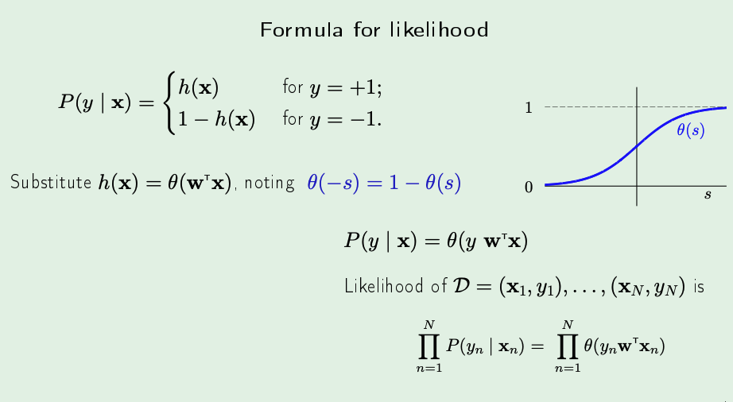
- i.e. we get the likelihood of $y$ occurring (for example), by multiplying the probability of $y$ occurring across the entire training data set 
- we also simplified the function from piecewise to a single line by noticing that, for a logistic function, $\theta(-s) = 1 - \theta(s)$
- next, if we would like to maximize the likelihood of some event (for example to train a neural net):
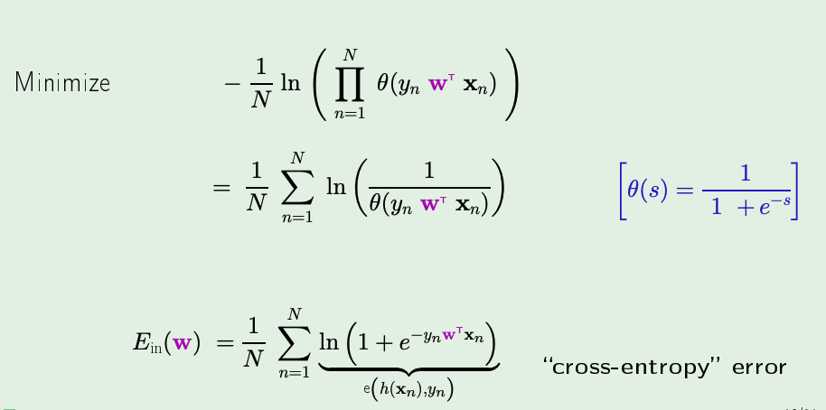
- why $ln$, $-1$ and $\frac{1}{N}$? basically for the sake of bounding the in-sample error
- note: we can take the natural log without changing the meaning of anything since the logistic function is strictly non-negative and multiplying by $\frac{1}{N}$ just creates proportional result
- $-1$ means we minimize instead of maximize!
- the rest of the derivation is just algebra (you can easily do this in your head if you think about how log works)
- in the result, the inner statement is the "cross-entropy" error and we are just assigning its average to be $E_{in}$

## Ok, but how do I learn after all that?
- recall, learning = minimizing $E_{in}$
- how to minimize $E_{in}$ for logistic reg (the monstrosity derived from earlier)

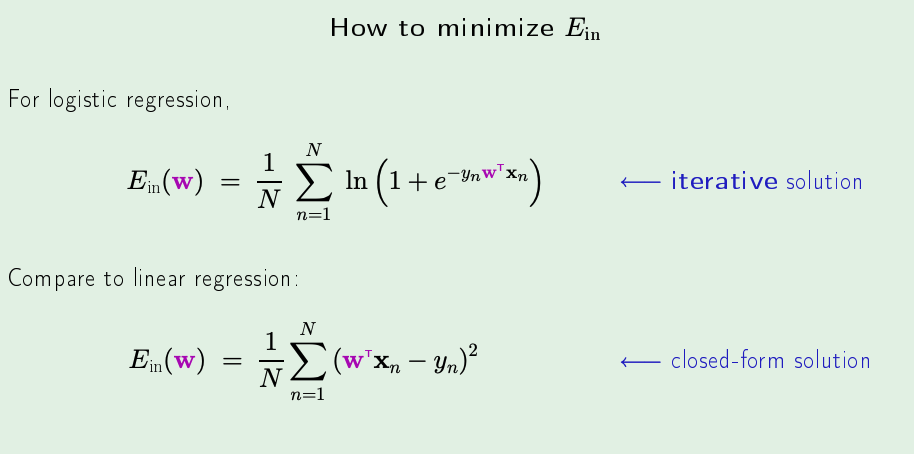
- we can't really do it in one step like linear regression, but we can iterate to it!

## Gradient Descent 
- this is one iterative method
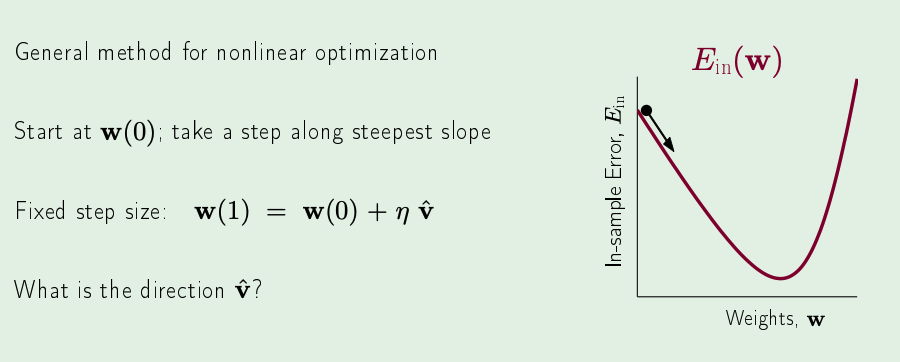
- in the picture above, its supposed to be in 3D or even higher dimensions, which is why we are using vectors (but also that comes from the definition of a gradient -> i.e. vector of PDEs of some function where each PDE is taken w.r.t to the parameters of that function)
- $\eta$ above is the "learning-step" or "learning-rate". All it is, is a bound on how far we want to travel down the gradient. If it's just 1, then we are travelling all of $\hat{v}$, if its 0.5, then we are travelling half the way and so on.
- why we do the above is essentially to minimizing the total number of iterations it takes to get to the lowest $E_{in}$ point.
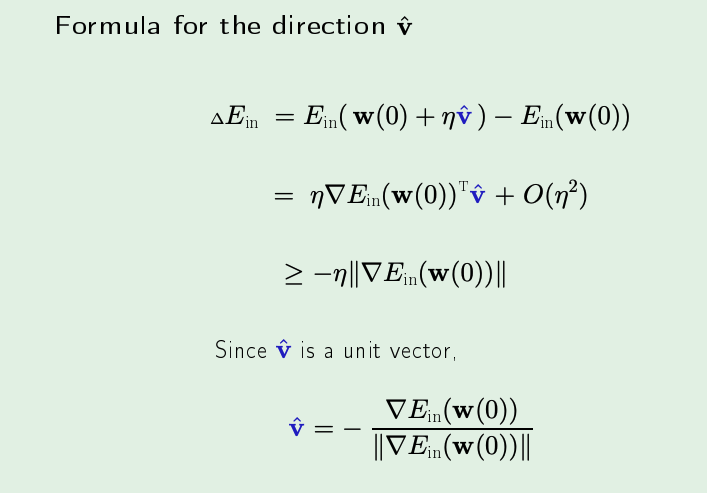
- We want the change in $E_{in}$ to be minimized (i.e. a negative number would be great!)
- the gradient is what we have on the second line with an extra something in $\eta^2$ which we ignore
- which means, the gradient term is all we need to bound
- $\hat{v}$ is a unit vector, so as far as the left term is concerned, its magnitude is not affected by the $\hat{v}$. Therefore, the magnitude of the left term is bounded by the gradient of the change in $E_{in}$, which at its lowest can be $-\eta$ * the gradient (in the case that the gradient vector and $\hat{v}$ are completely pointing opposite. )
- note that we want it to be at its lowest (we wanted to minimize it!), and since we can choose $\hat{v}$, we choose it to be directly opposite to the gradient term and normalize it to maintain it being a unit vector and we are done!

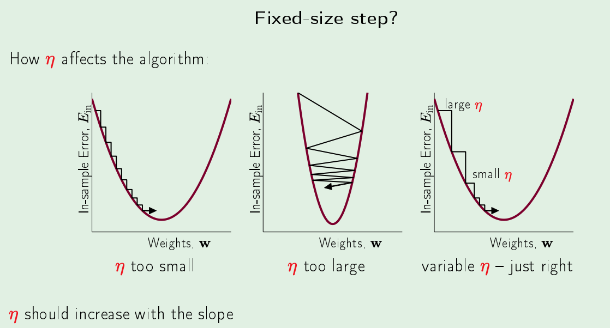
- we want $\eta$ to vary and be proportional to the magnitude of the gradient change in $E_{in}$, and this is quite easy and leads to the below 

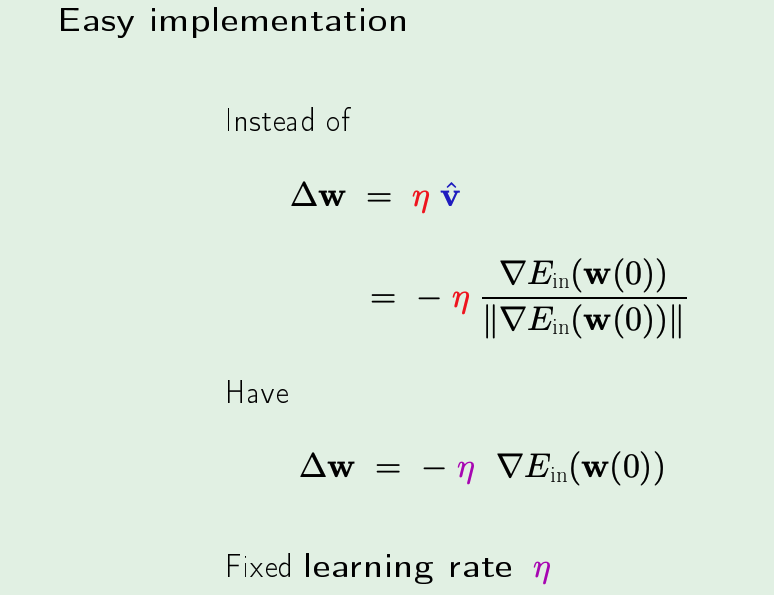
- by always ensuring that $\eta$ is a multiple of the magnitude of the change in gradient, we essentially can now have it be "fixed" 

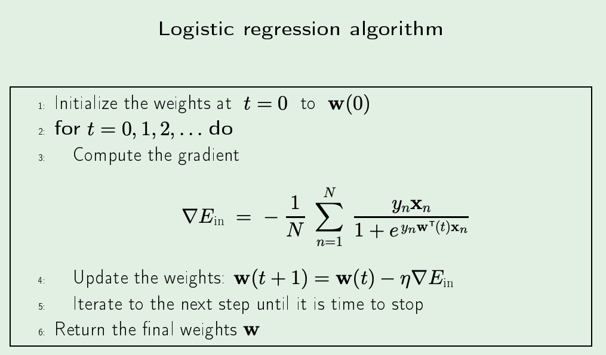
