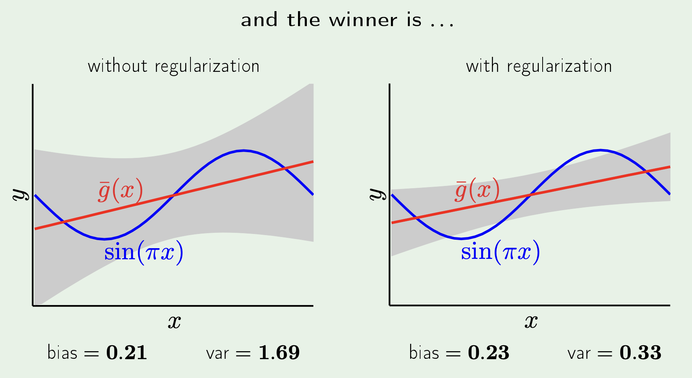
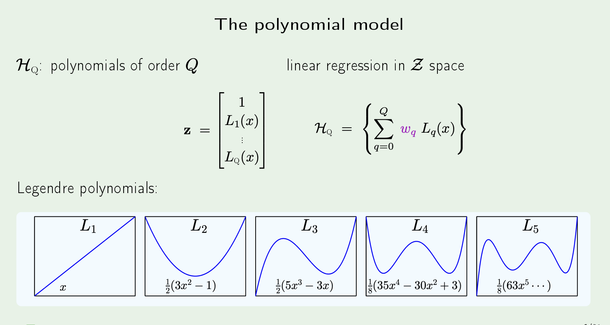
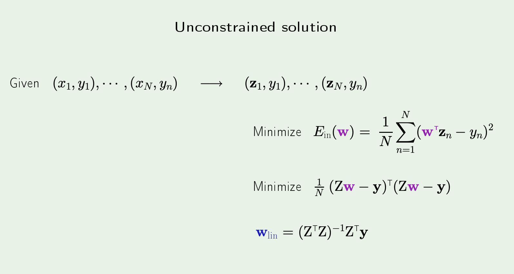
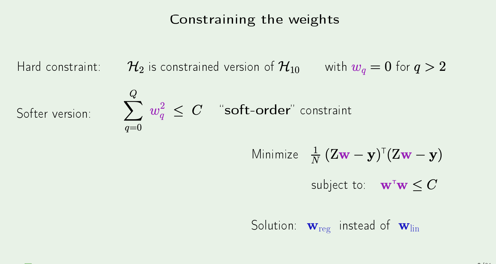
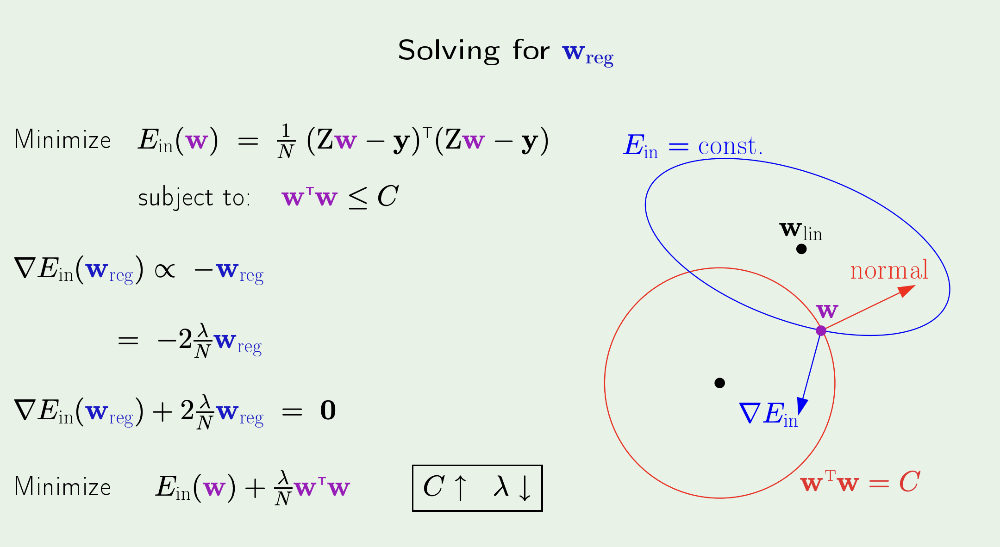
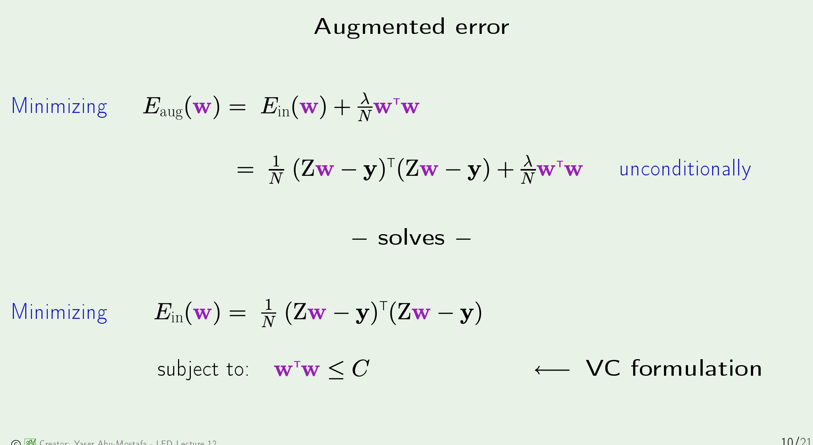
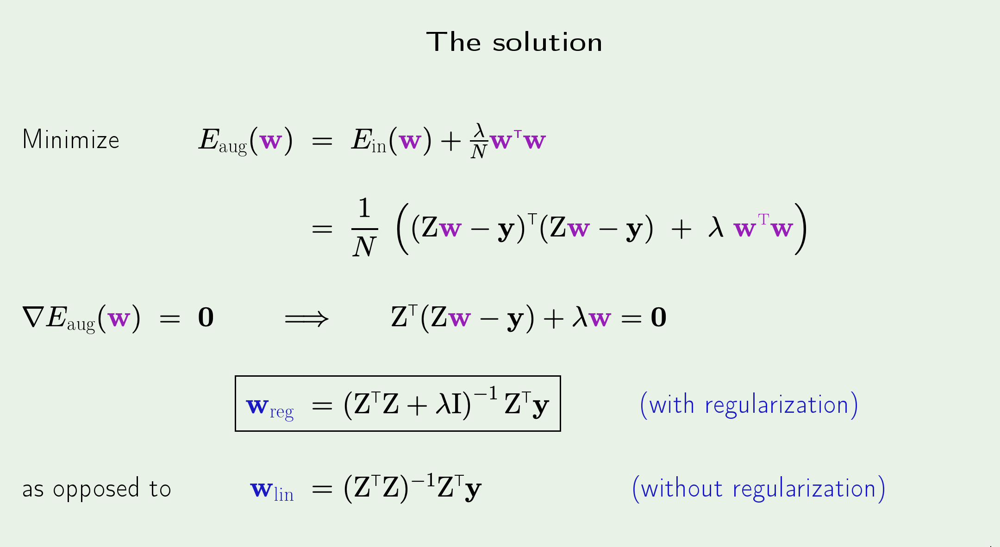
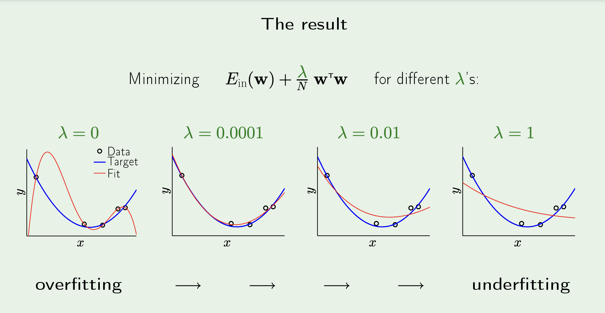

# Overfitting (L11)
- Occurs when we fit the data more than what we need -> which actually means we end up fitting the noise

- important takeaway from the above is -> if we are trying to fit a simple noisy target, it is easy to see how 
trying to fit curves of a higher dimension can lead to overfitting and a worse $E_{out}$
- What is not obvious is that this also happens for _noiseless_ targets -> just note that we are trying 10th order polynomials but the right hand side was generated with a 50th order polynomial 
- it's basically like even the noiseless target has **noise**? (more on this later)

- the grey region above signifies the overfitting region -> i.e. when the $E_{out}$ of a higher dim hypothesis set is higher than that of a lower dim hypothesis (again assuming the target is defined in a really high dim)
- also note that, given enough points through - the higher dim hypothesis **does** perform better than the lower dim one!

## Experiment to explore impact of noise level and target complexity 

- ^ if the overfit measure is positive -> then we indeed have overfitting. If it is negative, then we do not have any. (nothing to conclude if it is 0 but we can say that at least there is no overfitting)

- the color scale in this image refers to the overfit measure (worse if more positive -> i.e. the dark red region)
- stochastic noise is just what we generally think of as noise -> the added $\epsilon(x)$ to some target function. Obviously, as that goes up -> overfitting gets worse
- deterministic noise is what we were trying to capture in the case earlier when we had a "noiseless" target but we still had a bad $E_{out}$. This is basically the "noise" due to the fundamental difference in the complexity of a hypothesis and the target -> i.e. if a target is a 10th order poly and our hypothesis is only a 5th order, we will never be able to perfectly capture the target -> which ML people still call "noise", because as it turns our, the analysis is the exact same 
- if you are wondering why in the case of deterministic noise, for the lower target complexity do we still get a "rainbow" (for few data points) -> because we were trying to fit with a 10th order poly! (so the complexities did match)

## Deterministic Noise

- highlighting the fact that it is **fixed** for a given $x$ unlike stochastic noise!
- regardless of that, analysis of this is the same as stochastic noise!

## Relating this with Bias-Variance 
- if we simply replace the $f(x)$ in the prev bias-var analysis with some $y = f(x) + \epsilon(x)$ that also captures noise -> we get:

- $\mathbb{E}[\epsilon(x)] = 0$! -> the expected value will be 0 -> so it can be proven that the cross-terms above all work out to be 0
- which means we are left with:

- bias was deterministic noise all along! (recall that $\bar{g}$ was the best hypothesis we can come up with -> so the difference between the best $g$ and the target is fundamentally something we cannot do anything about for a given hypothesis set) 

## How to prevent overfitting?
1. Regularization 
2. Validation 

# Regularization (L12)
Approaches: 
1. Mathematical - through approximations based on some assumptions (if assumptions don't hold, these are not useful)
2. Heuristic - changing how we minimize $E_{in}$

- variance goes down heavy since we limit how much the hypotheses vary in $y$ and limit their gradients. Bias suffers a little as a result but nothing in comparison to the reduction in variance!

- Using Legendre polynomials specifically since their coefficients are s.t. each polynomial is orthogonal to each other (i.e. the weights assigned to each will now actually have an impact)

- $Z$ is now defined s.t. each of its rows is one $z_i^{T}$. In order to simulate square, we have to transpose one and multiple with the other. 
- $w_{lin}$ is simply what we had before with linear regression where we use a pseudo-inverse in order to get the weights 

- we now assign a cost $C$ (i.e. just an upper bound), to the sum of the square of all weight terms across the $q^{th}$-order polynomial (i.e. simply $w^Tw \leq C$ )

- idek -> trust the process ig

- we are simply adding the extra term on the right for the aug error in order to account for the regularization (it literally represents regularization)

- the $\lambda$ term here changes the "magnitude" of the regularization (informally) -> which is why the formula w/o regularization is just the one with regularization where $\lambda$ is set to 0. 

- NOTE: we do not necessarily want make $\lambda$ huge -> that has the opposite effect of underfitting 

