# Validation (L13)
- why? -> to reduce overfitting 
- how is this any different to regularization? 
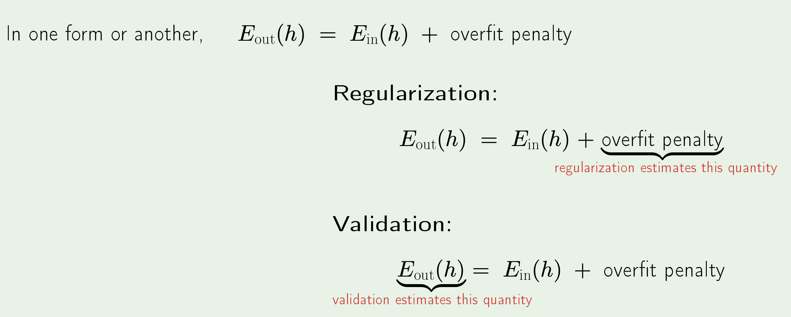

How do we analyze some estimate? -> 
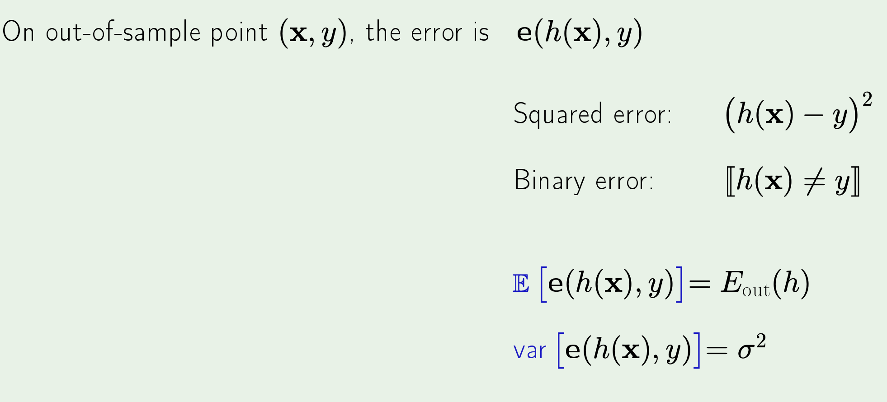

How do we better analyze some estimate? (use more points!) -> 
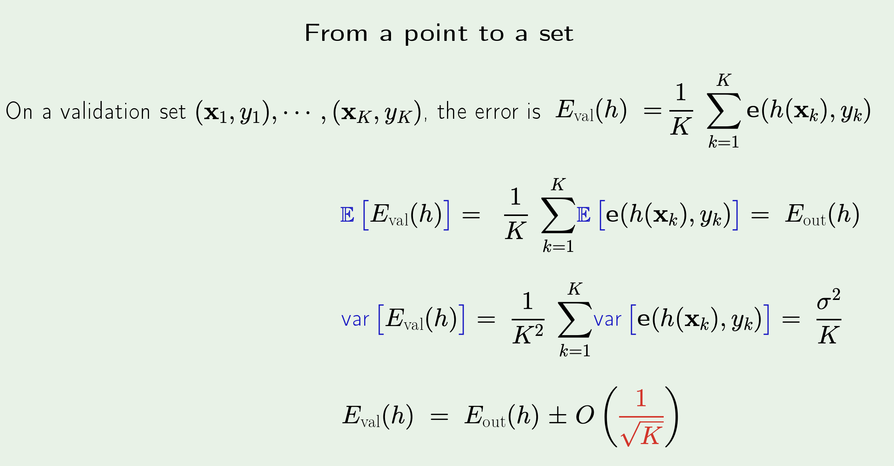
- note that the $\sigma^2$ is slightly deceptive notation wise, since we actually have $k \cdot \sigma^2$, which is why we divide by $k$ for the estimate 
- note also that $K$ here depicts $K$ points which are being used for validation **OUT OF** the $N$ points we have initially. (more on this right below)

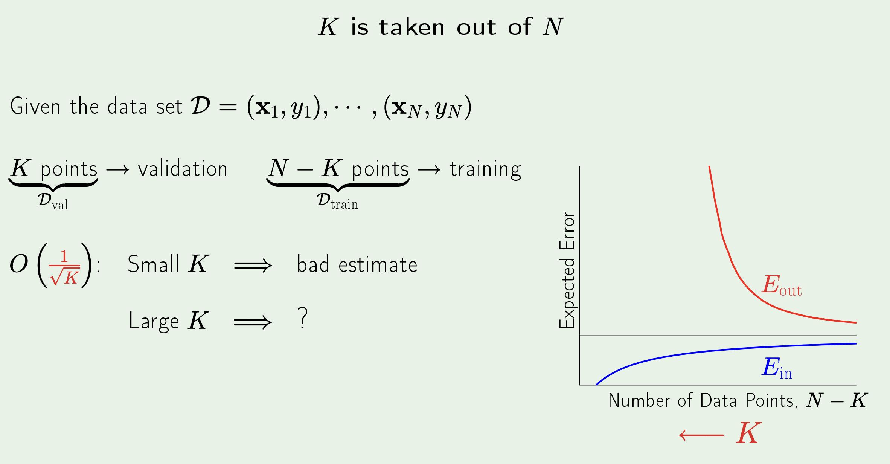
- small $K$ means there $E_{val}$ tracks $E_{out}$ worse (as given by the formula in the previous image)
- large $K$ is also problematic, and is described as below 

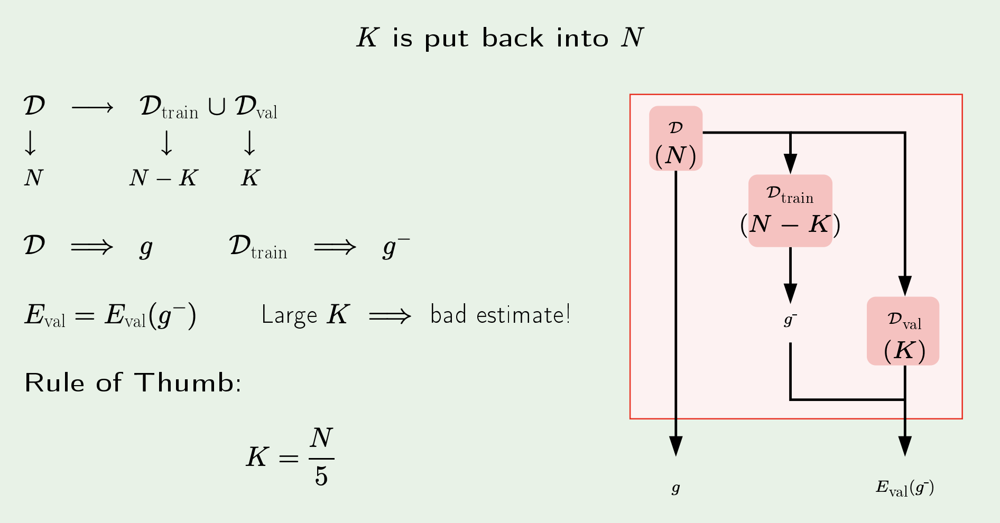
- with a large $K$, we have fewer training points left in order to actually derive a decent hypothesis (num training pts: N - K) -> which means validation is completely unhelpful here
- we counter this with the construction as above -> we still initially train with $N - K$ points and use $K$ for validation in order to derive some $E_{val}(g^-)$ ($g^-$ to differentiate from $g$ which comes from training with all points) -> but then, we also train with $N$ points anyway to derive some $g$ and claim that $E_{val}(g^-)$ is a good estimate for the validation error of $g$! 

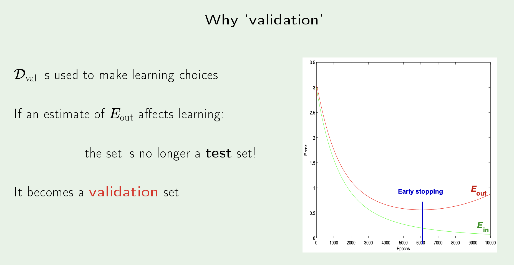

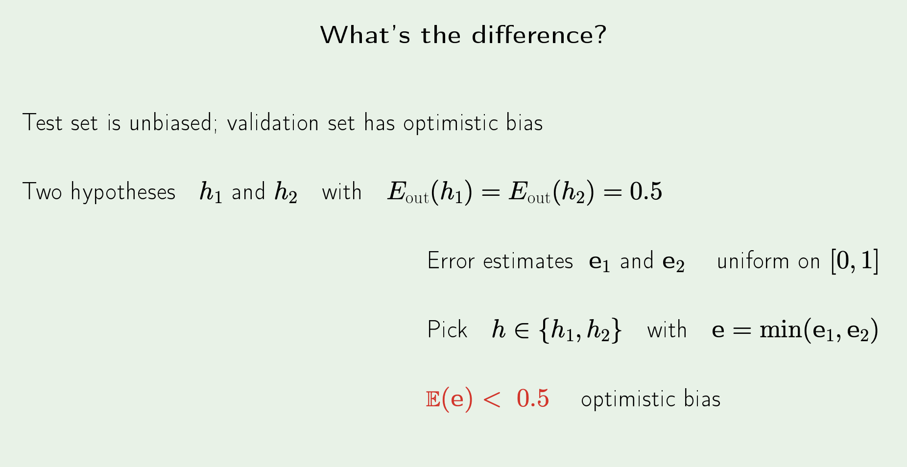
- since we are always going for the minimum, and both $e_1$ and $e_2$ are uniform and unbiased - we actually end up ensuring that on average their minimum will be less than 0.5

## Model Selection 
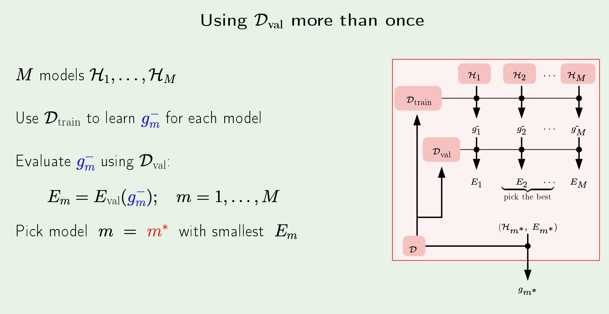
- each model is a hypothesis set (for example -> a set of order 2 polynomials or order 3 polynomials, etc)
- We train each hypothesis set using some $D_{train}$, derive the appropriate $g_n^-$ and its validation error. Then, pick the hypothesis set from which $g_n^-$ with the lowest validation error came from (this introduces optimistic bias for $E_{out}$!) and then get $g$ by training is normally on all points. The result of all this is that we narrow down to a particular hypothesis set (denoted $H_m^*$), associated with a validation error of $E_m^*$ and some hypothesis $g_m*$. 
- Note that $E_m^*$ is also a pessimistic error since $g_m*$, which is trained on **all** data points, is expected to have a lower $E_{out}$

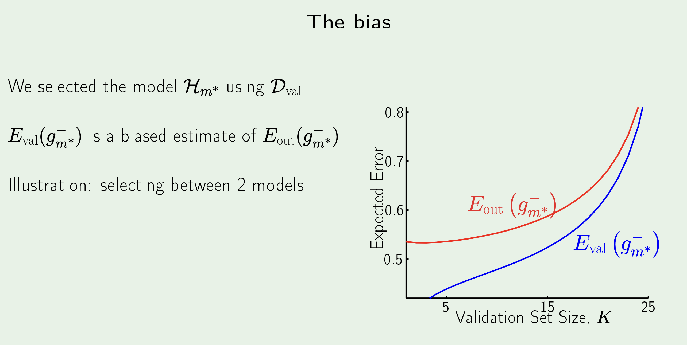
- note that both the errors rise with $K$, since we are training the model with fewer $N-K$ points
- note that as $K$ rises, $E_{val}$ tracks $E_{out}$ better. 
- in some sense, we want $K$ to be both large and small :0

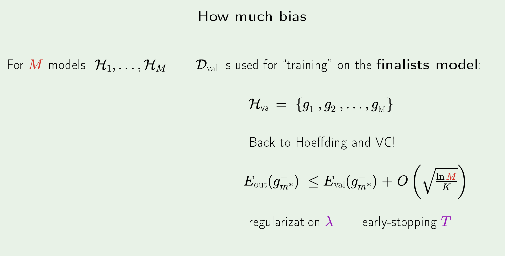
- we can analyze the bias by thinking of $E_{val}$ as the new $E_{in}$ (from the pov of $E_{out}$, $H_{val}$ is the only hypothesis set it needs to look at -> even-though technically it has undergone "preprocessing" with us only selecting the absolute best $g_n^-$ from every hypothesis set and creating a new hypothesis set from those -> "finalists model")

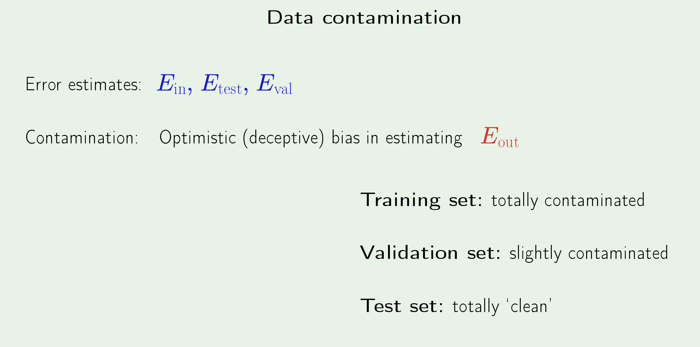

## Cross-Validation 
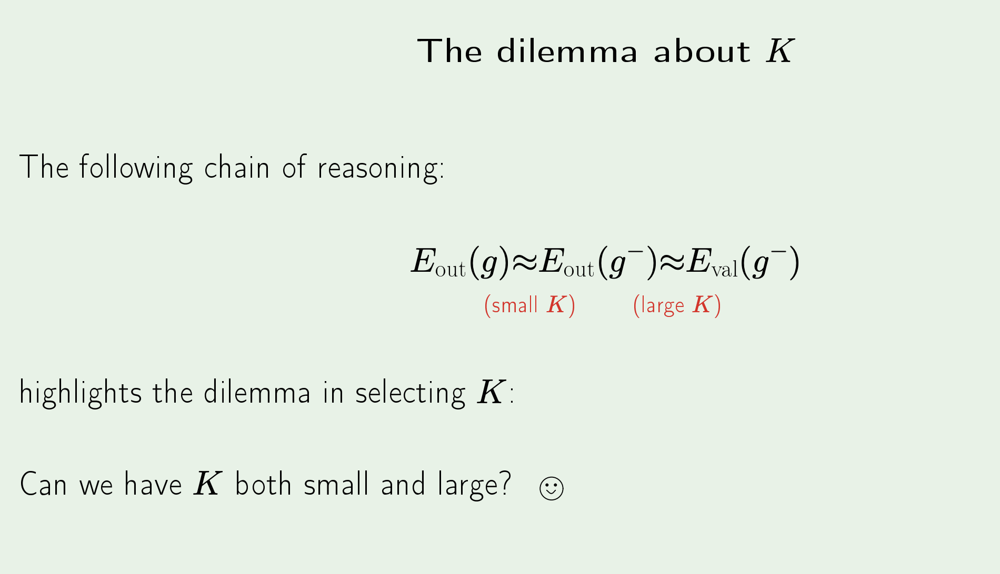
- cross-validation tackles this dilemma exactly
- we discuss the "leave-one-out" strategy, but the rest just involve leaving more points out
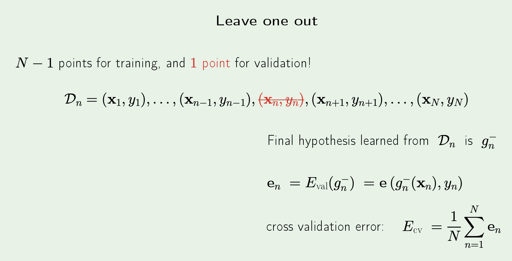
- we train using $N-1$ points and only use 1 point for validation 
- this does mean that $E_{out}(g)$ is better tracked by $E_{out}(g^-)$, however it may seem like $E_{val}(g^-)$ is now going to be horrible at tracking $E_{out}(g^-)$
- however, the strategy actually involves running this process for **every** point (N times), calculating the error and letting $E_{cv}$ be the average of all those error 
- it turns out that $E_{cv}$ actually tracks $E_{out}(g^-)$ quite well 

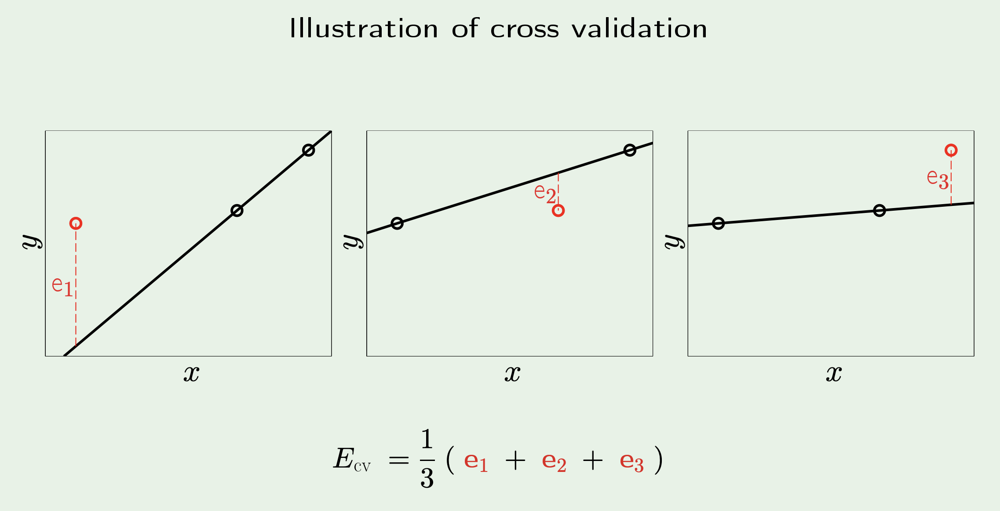

- we can generalise the idea of cross-validation and start leaving out more points for validation since running validation $N$ can get really expensive as $N$ grows
- we can create "folds" of size $\frac{N}{K}$ for some constant $K$ and use one fold for validation while the others are used to train
- repeat this for every fold and we get our $E_{cv}$
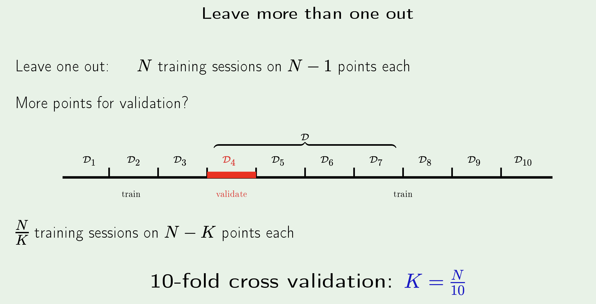